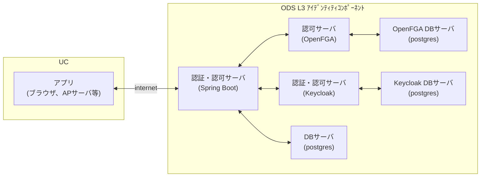

# Open Data Spaces L3 Authenticator System Configuration Diagram

## ODS基盤 L3ユーザ認証システム構成図

### 用語説明
|名前                                        |意味|
|:-------------------------------------------|:----|
|UC|ユースケース（事業者・個人）|
|ODS|OPEN-DATASPACESの略称|
|L3|ODSで定められているアイデンティティレイヤ、認証・認可の問題を解決する|
