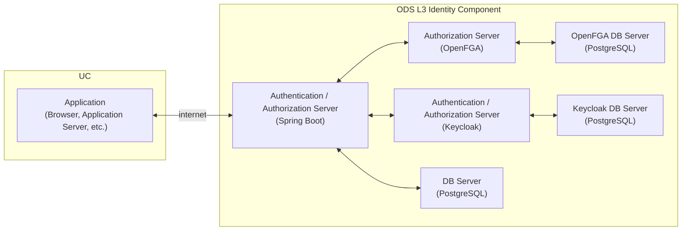

# Open Data Spaces L3 Authenticator System Configuration Diagram

## ODS Platform L3 User Authentication System Configuration Diagram

### Terminology
|Name                                        |Description|
|:-------------------------------------------|:----|
|UC|Use Case (Business Operator or Individual)|
|ODS|Abbreviation for OPEN-DATASPACES|
|L3|Identity layer defined in ODS that resolves authentication and authorization issues|